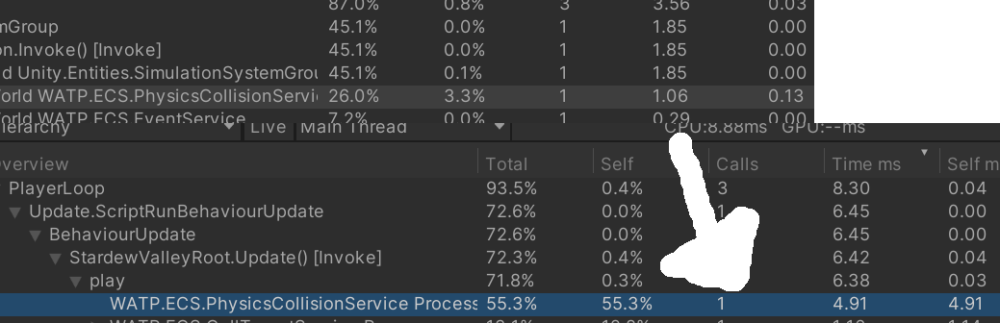

# StardewUnity

# 소개
stardewvalley를 unity를 이용하여 모작한 프로젝트입니다. 
해당 자료를 보는 순서는 다음과 같습니다. 

 

---
 

## 기능 및 설명
해당 문서에서는 해당 프로젝트를 만든 목표 및 기능을 볼 수 있습니다.  

문서 <https://polydactyl-stoat-7af.notion.site/Stardew-Valley-4ddd7519bf454a54985ae094c0d988bb> 

영상 <https://www.youtube.com/watch?v=tXg3M3O0QkM>   

간략하게 요약하면 unity를 이용한 기능 구현 및 dots를 이용한 성능개선을 보기 위한 포트폴리오용 프로젝트입니다. 
해당 문서에서는 공부한 내용과 code 예시 기반의 설명을 진행합니다.

---
 

## 핵심 목표
프로젝트의 핵심 목표는 다음과 같습니다.  

* Unity Dots를 이용한 프로젝트 (Pure)
* Unity TileMapSystem을 이용한 Maptool
* 다양한 기능 구현 (농사, 채집, 상점, npc 상호작용, 계절)

 

---
 

## Base
해당 프로젝트는 여러부분을 나눠 제작해보려고 노력했습니다. 
다음은 설명이 필요하다고 느껴지는 요소을 나타냅니다.

* [Root](./StardewValley/Assets/Scripts/StardewValley/README.md) - 각 Project의 시작 부분입니다.
* [GameState](./StardewValley/Assets/Scripts/StardewValley/Data/README.md) - 게임의 전체 정보 및 상황이 저장(Observer).
* [MapObjectManager](./StardewValley/Assets/Scripts/StardewValley/Data/Object/README.md) - Map에서의 Entity들을 관리.
* [ViewManager](./StardewValley/Assets/Scripts/StardewValley/View/README.md) - Entity중 render가 필요한 요소를 관리.
* [DataManager](./StardewValley/Assets/Scripts/Base/Data/README.md) - Table data, 환경 설정등 저장된 정보를 관리.

---
 

## Dots
대규모 연산시 성능 향상을 위해 적용해보는 아키텍처입니다. 
전체적으로 Pure ECS를 구성했으며 이동 및 충돌 처리 부분에서 Job을 활용했습니다. 

- 성능 
  
system 전체  8.30 -> 1.85ms 
충돌 처리 부분 4.92 → 1.05 ms 
전반적으로 5배 정도의 성능 향상 폭을 보였습니다.  

- 디 커플링 
ECS의 설계 방식으로 디커플링이 일어나 유지 보수성이 상승할 것으로 예상됩니다. 
 

해당 부분의 자세한 설명입니다. 
[링크](./StardewValley/Assets/Scripts/StardewValley/ECS/README.md) 

---
## Maptool
Unity의 Map은 Editor 상에서 Tile Palette를 이용해 Tilemap을 구성하게 됩니다. 
해당 기능을 이용해서는 Tile(각 cell)을 이용한 인 게임 기능 옵션들을 설정시 따로 구성이 되야하는 단점이 있었습니다. (render가 따로 구현되야 함) 
해당 프로젝트에서는 Maptool을 이용하여 두 기능을 한 곳에서 설정하고 게임시 이용 가능하게 구성해보았습니다. 

해당 부분의 자세한 설명입니다. 
[링크](./StardewValley/Assets/Scripts/StardewValley/Map/README.md) 

---
 

## 기능
기능 설명은 System Code들을 참조 할 수 있고 
부가적으로 해당 링크에서 확인 가능합니다. 
<https://polydactyl-stoat-7af.notion.site/Stardew-Valley-4ddd7519bf454a54985ae094c0d988bb> 

---
 

## 마치며
Dot의 성능 향상 폭 확인 및 2D 게임을 개발해보는 좋은 경험이 되었습니다. 
아쉬운 점으로는 Dots의 ECS를 적용하기 위해서는 개발 초기가 아닌 이상 비용이 커보인다는 점,  
Jobs 및 service로직을 구현하기 위해서 세부적으로 나눠 부가적인 작업이 필요하다는 점이 생각되었습니다. 
대규모 연산 작업일 경우 도입이 대체적인 경우에서는 큰 성능 향상 폭을 보이겟으나 
다른 케이스에서는 아키텍처상 도입을 고민해봐야 하는 문제입니다. (유지 보수등) 

Maptool에 대해서는 대체적으로 원하는 기능 구현을 완성했습니다. 
그러나 이미지를 런타임에서 불러와야 하는 이슈가 있기 때문에 해당 부분을 Atlas를 이용해서 처리하거나 혹은 Tilemap 자체를 저장해 사용하는 방법을 택하는 것으로 퍼포먼스 향상을 이룰 수 있을것으로 생각합니다. 이는 추가 개발의 여지로 남겨 두었으며 추후 수정의 가능성이 존재합니다. 

---