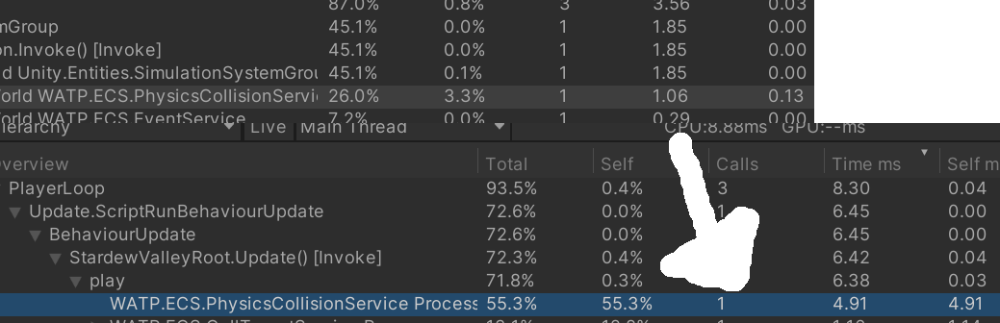

# Dots
대규모 연산시 성능 향상을 위해 적용해보는 아키텍처입니다.
해당 부분 설명을 위해 각 부분으로 나눠 설명합니다.<br/><br/>

## ECS
Entity Component System의 약자로 게임 오브젝트 데이터를 엔티티, 컴포넌트, 시스템으로 분리해 사용합니다.

데이터 지향 기술 스택(Data-Oriented Technology Stack)으로 설계된 시스템으로 같은 구성 요소(Component)를 갖는 데이터를 그룹화하여(Archetype) chunk 단위로 저장하고 system에서 component의 접근시 청크 리스트에 접근, 사용하여 캐시 히트율을 높여 성능 향상도 도모할 수 있는 시스템입니다.

추가적으로 entites package가 필요합니다.<br/><br/>

---
### Entity

- 어떤 component를 가지고 있는지 식별하는 ID, 이름이 없는 초경량 gameobject.<br/>
- 같은 component 구성을 가진 entity 조합(Archetype)을 chunk단위로 저장하여 사용됩니다.<br/><br/>

생성 예제

```cs
World.DefaultGameObjectInjectionWorld.EntityManager.CreateEntity();
World.DefaultGameObjectInjectionWorld.EntityManager.CreateEntity(typeof(component));
```
<br/>

제거 예제
```cs
World.DefaultGameObjectInjectionWorld.EntityManager.DestroyEntity(entity);
```
<br/>

---

### Component

- entity의 속성(data)를 정의하는 요소<br/>
- 같은 component 구성을 가진 entity 조합(Archetype)을 chunk단위로 저장하여 사용됩니다.<br/>
- system에서 조회하여 사용 가능합니다.<br/>

생성 예제

```cs
public struct TransformComponent :IComponentData
{
    public float3 position;
    public float3 rotation;
}
```

<br/>

```cs
public Entity Build()
{
    var entity = World.DefaultGameObjectInjectionWorld.EntityManager.CreateEntity();
    World.DefaultGameObjectInjectionWorld.EntityManager.AddComponent<TransformComponent>(entity);
    World.DefaultGameObjectInjectionWorld.EntityManager.AddComponent<DeleteComponent>(entity);
    return entity;
}
```
<br/>

- Component는 역활에 따라 unmanaged, managed, tag 등으로 나눠집니다.<br/>
-> unmanaged는 struct, managed는 class 로 정의해 사용합니다.<br/>
-> unmanaged는 호환되는 일부 타입만 사용 가능합니다.(jobs, burst 위함)<br/>
-> managed는 추후 Burst 및 Job 사용시 제한이 존재합니다.(최적화 제한)<br/>


예제

```cs
public struct MoveComponent : IComponentData
{
    /// <summary> 움직임 가능여부 </summary>
    public bool isEnable;
    /// <summary> 목표 /// </summary>
    public float3 targetPos;
    /// <summary> 이전 포지션 /// </summary>
    public float3 beforePos;
    /// <summary> 현재 이동 속도 /// </summary>
    public float speed;
    /// <summary> 이번 턴 움직임 유무 /// </summary>
    public bool isMoveTurn;
}
```
<br/>

Component는 해당 폴더에 정의되어 있습니다.<br/>
[Component 폴더](/Component)<br/>

---
### System

- component를 업데이트 하는 로직입니다.<br/>
- 특정 조건(component)를 만족하는 entity를 조회해서 업데이트하는 방식을 기본으로 사용합니다.<br/>
- unmanaged component만 조작시 job으로 변경 가능합니다.<br/>

```cs
[UpdateBefore(typeof(InputMoveSystem))]//해당 system 이전 동작해야하는 system
[UpdateAfter(typeof(CellTargetSystem))]//해당 system 이후 동작해야하는 system
[RequireMatchingQueriesForUpdate]
public partial struct MoveSystem : ISystem
{
    [BurstCompile]
    public void OnCreate(ref SystemState state)
    {
        state.RequireForUpdate<MoveComponent>();
        state.RequireForUpdate<NormalSystemsCompTag>();
    }

    [BurstCompile]
    public void OnUpdate(ref SystemState state)
    {
        foreach (var tag in SystemAPI.Query<RefRO<PauseSystemsCompTag>>())
            return;
        var job = new MoveJob()
        {
            frameTime = SystemAPI.Time.DeltaTime
        };
        var handle = job.ScheduleParallel(state.Dependency);
        handle.Complete();
    }
}
```

System은 해당 폴더에 정의되어 있습니다.<br/>
[System 폴더](/System)<br/><br/>

---

### Aspect
- entity 요소의 하위 집합을 단위 C#구조체로 그룹화하는 래퍼<br/>
- 해당 프로젝트에서는 Component를 가지고 있는 Object 처럼 사용하였습니다.<br/>
- aspect를 entity가 필요한 각 부분(ex:view)에서 사용함으로 재 참조를 명시적으로 구현해야합니다.<br/>

```cs
public readonly partial struct FarmerAspect : IAspect, IWATPObjectAspect
{
    #region Property
    public readonly Entity entity;

    readonly RefRW<TransformComponent> transformComponent;
    readonly RefRW<EventComponent> eventComponent;
    readonly RefRW<PlayerComponent> playerComponent;
    readonly RefRW<MoveComponent> moveComponent;
    readonly RefRW<ColliderComponent> colliderComponent;
}
```
aspect은 해당 폴더에 정의되어 있습니다.<br/>
[Aspect 폴더](/Entity)<br/><br/>

---

### 기타 추가적 요소
- Pure

    - gameobject 및 mono를 ecs 상에서는 완전히 제거하였습니다.<br/>
    - data만을 이용하여 프로젝트를 구동하는 것이 가능합니다.<br/>
    - 대신 모든 제어를 code단에서 수행하여야 하며 convert(prefab component -> ecs compoent로 변환) 혹은 authoring(prefab에 적용)부분이 존재하지 않습니다.<br/>
    - 해당 프로젝트에서는 View가 aspect를 참조해 prefab을 표현 해줍니다.<br/>


- Structural change

    - entity를 추가, 제거하거나 entity에 component를 추가, 제거할때에도 structural change가 일어납니다. <br/>
    - structural change가 일어나면 전체 데이터 구조를 재 설정함으로 모든 참조가 깨지게 됩니다.(Native 할당 또한)<br/>
    - 해당 프로젝트에서는 structural change를 제어하기 위해 map의 entity가 생성, 제거될때를 한 곳에서 제어합니다.<br/>
    [링크](../Data/MapObjectManager.cs)<br/>

    재 참조 예시
```cs
    private void RefUpdate()
    {
        if (isRefUpdate == false) return;
        for (var i = 0; i < aspects.Count; i++)
        {
            switch(aspects[i])
            {
                case FarmerAspect:
                    aspects[i] = World.DefaultGameObjectInjectionWorld.EntityManager.GetAspect<FarmerAspect>(aspects[i].Entity);
                    player = aspects[i];
                    break;
                case AnimalAspect:
                    aspects[i] = World.DefaultGameObjectInjectionWorld.EntityManager.GetAspect<AnimalAspect>(aspects[i].Entity);
                    break;
```

<br/>

- Random

    random시 job에서 이용가능하게 처리하려면 component를 추가한 entity가 하나 필요합니다.(조회 가능하게)<br/>
    
```cs
public struct RandomComponent : IComponentData
{
    public Unity.Mathematics.Random Random;
}
```
<br/>

- Mathematics

    Unity의 C# SIMD 수학 라이브러리로 burst를 이용하기 위해서 사용하는 라이브러리입니다.<br/>
    기존 타입의 math api대신 해당 라이브러리를 사용해야 합니다.<br/> 
<br/>

---
<br/>

## Burst
Mono가 플랫폼 별 코드를 해석하여 실행하는 구조라 실행 속도가 보다 느렸습니다.<br/>
이를 해결하고자 컴파일 대상 플랫폼에 맞춰 최적화된 코드로 변환해 성능을 개선해주는 컴파일러입니다.<br/>
심플하게 BurstCompile 부분만 추가하면 되지만 제한된 코드가 많아 (unmanaged만 거의 가능) 고려해야합니다<br/>

```cs
    [BurstCompile(CompileSynchronously = true)]
    public partial struct MoveJob : IJobEntity
    {
    }
 ```

---
<br/>

## Job
unity는 싱글 스레드 기반이라 다중 스레드 작업시 경쟁 조건, 데드락등의 문제를 고려해야 합니다.<br/>
이를 위해 c#의 job을 이용해 unity에서 안전한 멀티스레딩을 구현하는 시스템입니다.<br/>
별도의 스레드를 생성하지 않고 워커스레드에서 잡을 가져와서 실행하는 방식입니다.<br/>

[링크](/StardewValley/Assets/Scripts/StardewValley/ECS/System/MoveSystem.cs)<br/>
```cs
[BurstCompile(CompileSynchronously = true)]
public partial struct MoveJob : IJobEntity
{
    public float frameTime;
    // Execute() is called when the job runs.
    public void Execute(Entity entity, ref TransformComponent transform, ref MoveComponent move, ref PhysicsComponent physics)
    {
        move.isMoveTurn = false;
        if (move.isEnable == false || math.all(move.targetPos == float3.zero)) return;

        if (move.targetPos.y > transform.position.y)
        {
            transform.rotation = new float3(0, 1, 0);
        }
        else if (move.targetPos.y < transform.position.y)
        {
            transform.rotation = new float3(0, -1, 0);
        }
        else if (move.targetPos.x > transform.position.x)
        {
            transform.rotation = new float3(1, 0, 0);
        }
        else if (move.targetPos.x < transform.position.x)
        {
            transform.rotation = new float3(-1, 0, 0);
        }
        else
            return;

        var power = move.speed * frameTime;
        var dis = math.distance(move.targetPos, transform.position);
        if (power > dis)
            power = dis;

        physics.velocity += transform.rotation * power;
        move.isMoveTurn = true;
    }
}
```

    
---


# 결과

- 성능<br/>
<br/><br/>
system 전체  8.30 -> 1.85ms<br/>
충돌 처리 부분 4.92 → 1.05 ms<br/>
전반적으로 5배 정도의 성능 향상 폭을 보였습니다.<br/><br/>

- 디 커플링<br/>
ECS의 설계 방식으로 디커플링이 일어나 유지 보수성이 상승할 것으로 예상됩니다.<br/>